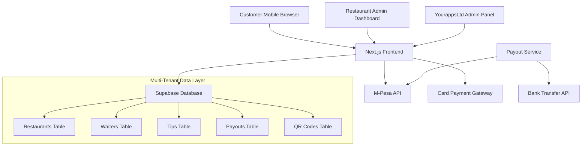

# Design Document

## Overview

Tippy is a multi-tenant QR code-based tipping platform built on Next.js and Supabase, designed specifically for the Kenyan market. The system enables restaurants to generate QR codes for tables, allowing customers to tip individual waiters or the restaurant through M-Pesa and card payments. The platform implements a commission-based revenue model with configurable rates and automated monthly payouts.

## Architecture

### High-Level Architecture



### Multi-Tenant Architecture

The system implements a shared database, separate schema approach using Supabase Row Level Security (RLS):

- **Tenant Isolation**: Each restaurant is a tenant with a unique `tenant_id`
- **Row Level Security**: All tables include `tenant_id` and RLS policies ensure data isolation
- **Shared Infrastructure**: Single Next.js application serves all tenants
- **Tenant Context**: Authentication includes tenant context for all operations

### Technology Stack

- **Frontend**: Next.js 14 with TypeScript, Tailwind CSS
- **Backend**: Next.js API routes with server actions
- **Database**: Supabase (PostgreSQL) with Row Level Security
- **Authentication**: Supabase Auth with custom tenant context
- **Payments**: M-Pesa Daraja API, Stripe/Flutterwave for cards
- **QR Generation**: qrcode.js library
- **Deployment**: Vercel (frontend), Supabase (database)

## Components and Interfaces

### Core Components

#### 1. QR Code Scanner Interface
- **Purpose**: Customer-facing tipping interface accessed via QR scan
- **Route**: `/tip/[restaurantId]/[tableId]`
- **Features**:
  - Restaurant branding display
  - Tip type selection (waiter vs restaurant)
  - Waiter selection with search
  - Amount entry with presets
  - Payment method selection

#### 2. Payment Processing Service
- **Purpose**: Handle M-Pesa and card payment transactions
- **Components**:
  - M-Pesa STK Push integration
  - Card payment gateway wrapper
  - Transaction status tracking
  - Commission calculation and deduction
  - Webhook handlers for payment confirmations

#### 3. Restaurant Admin Dashboard
- **Route**: `/dashboard/[restaurantId]`
- **Features**:
  - Tip analytics and reporting
  - Waiter management (CRUD operations)
  - QR code generation and management
  - Distribution group configuration
  - Payout history and status

#### 4. Multi-Tenant Management
- **Purpose**: Handle tenant isolation and context
- **Components**:
  - Tenant middleware for request routing
  - RLS policy enforcement
  - Tenant-specific configuration management
  - Cross-tenant operation prevention

#### 5. Payout Processing System
- **Purpose**: Monthly automated payouts to restaurants and waiters
- **Components**:
  - Scheduled payout calculation (cron job)
  - M-Pesa bulk payment integration
  - Bank transfer processing
  - Payout notification system
  - Transaction reconciliation

### API Interfaces

#### Payment Processing APIs
```typescript
// M-Pesa STK Push
POST /api/payments/mpesa/initiate
{
  amount: number,
  phoneNumber: string,
  tipId: string,
  tenantId: string
}

// Card Payment
POST /api/payments/card/initiate
{
  amount: number,
  tipId: string,
  tenantId: string,
  returnUrl: string
}

// Payment Webhook
POST /api/webhooks/payment-confirmation
{
  transactionId: string,
  status: 'success' | 'failed',
  amount: number,
  tipId: string
}
```

#### Tip Management APIs
```typescript
// Create Tip
POST /api/tips
{
  restaurantId: string,
  waiterId?: string,
  amount: number,
  tipType: 'waiter' | 'restaurant',
  tableId: string
}

// Get Restaurant Tips
GET /api/restaurants/[id]/tips?month=2024-01

// Get Waiter Tips
GET /api/waiters/[id]/tips?month=2024-01
```

## Data Models

### Database Schema

```sql
-- Tenants (Restaurants)
CREATE TABLE restaurants (
  id UUID PRIMARY KEY DEFAULT gen_random_uuid(),
  name VARCHAR(255) NOT NULL,
  slug VARCHAR(100) UNIQUE NOT NULL,
  commission_rate DECIMAL(5,2) DEFAULT 10.00,
  created_at TIMESTAMP DEFAULT NOW(),
  updated_at TIMESTAMP DEFAULT NOW()
);

-- Distribution Groups Configuration
CREATE TABLE distribution_groups (
  id UUID PRIMARY KEY DEFAULT gen_random_uuid(),
  restaurant_id UUID REFERENCES restaurants(id),
  group_name VARCHAR(100) NOT NULL,
  percentage DECIMAL(5,2) NOT NULL,
  created_at TIMESTAMP DEFAULT NOW(),
  CONSTRAINT valid_percentage CHECK (percentage >= 0 AND percentage <= 100)
);

-- Waiters
CREATE TABLE waiters (
  id UUID PRIMARY KEY DEFAULT gen_random_uuid(),
  restaurant_id UUID REFERENCES restaurants(id),
  name VARCHAR(255) NOT NULL,
  phone_number VARCHAR(20) NOT NULL,
  is_active BOOLEAN DEFAULT true,
  created_at TIMESTAMP DEFAULT NOW(),
  updated_at TIMESTAMP DEFAULT NOW()
);

-- QR Codes for Tables
CREATE TABLE qr_codes (
  id UUID PRIMARY KEY DEFAULT gen_random_uuid(),
  restaurant_id UUID REFERENCES restaurants(id),
  table_number VARCHAR(50) NOT NULL,
  qr_data TEXT NOT NULL,
  is_active BOOLEAN DEFAULT true,
  created_at TIMESTAMP DEFAULT NOW()
);

-- Tips Transactions
CREATE TABLE tips (
  id UUID PRIMARY KEY DEFAULT gen_random_uuid(),
  restaurant_id UUID REFERENCES restaurants(id),
  waiter_id UUID REFERENCES waiters(id) NULL,
  table_id UUID REFERENCES qr_codes(id),
  amount DECIMAL(10,2) NOT NULL,
  commission_amount DECIMAL(10,2) NOT NULL,
  net_amount DECIMAL(10,2) NOT NULL,
  tip_type VARCHAR(20) NOT NULL CHECK (tip_type IN ('waiter', 'restaurant')),
  payment_method VARCHAR(20) NOT NULL,
  payment_status VARCHAR(20) DEFAULT 'pending',
  transaction_id VARCHAR(255),
  created_at TIMESTAMP DEFAULT NOW()
);

-- Monthly Payouts
CREATE TABLE payouts (
  id UUID PRIMARY KEY DEFAULT gen_random_uuid(),
  restaurant_id UUID REFERENCES restaurants(id),
  waiter_id UUID REFERENCES waiters(id) NULL,
  payout_type VARCHAR(20) NOT NULL CHECK (payout_type IN ('waiter', 'group')),
  group_name VARCHAR(100),
  amount DECIMAL(10,2) NOT NULL,
  payout_month DATE NOT NULL,
  status VARCHAR(20) DEFAULT 'pending',
  transaction_reference VARCHAR(255),
  processed_at TIMESTAMP,
  created_at TIMESTAMP DEFAULT NOW()
);
```

### Row Level Security Policies

```sql
-- Enable RLS on all tables
ALTER TABLE restaurants ENABLE ROW LEVEL SECURITY;
ALTER TABLE waiters ENABLE ROW LEVEL SECURITY;
ALTER TABLE tips ENABLE ROW LEVEL SECURITY;
ALTER TABLE qr_codes ENABLE ROW LEVEL SECURITY;
ALTER TABLE payouts ENABLE ROW LEVEL SECURITY;
ALTER TABLE distribution_groups ENABLE ROW LEVEL SECURITY;

-- Restaurant isolation policies
CREATE POLICY "Users can only access their restaurant data" ON waiters
  FOR ALL USING (restaurant_id = current_setting('app.current_tenant')::UUID);

CREATE POLICY "Tips are isolated by restaurant" ON tips
  FOR ALL USING (restaurant_id = current_setting('app.current_tenant')::UUID);

-- Similar policies for other tables...
```

## Error Handling

### Payment Error Handling
- **M-Pesa Failures**: Retry mechanism with exponential backoff
- **Network Timeouts**: 30-second timeout with user notification
- **Insufficient Funds**: Clear error message with retry option
- **Invalid Phone Numbers**: Client-side validation with format checking

### Database Error Handling
- **Connection Failures**: Automatic retry with circuit breaker pattern
- **Constraint Violations**: User-friendly error messages
- **RLS Policy Violations**: Security audit logging
- **Transaction Rollbacks**: Atomic operations for payment processing

### Multi-Tenant Error Handling
- **Tenant Context Missing**: Redirect to tenant selection
- **Cross-Tenant Access**: Security logging and access denial
- **Invalid Tenant**: 404 error with proper messaging

## Testing Strategy

### Unit Testing
- **Payment Processing**: Mock M-Pesa and card payment APIs
- **Commission Calculations**: Test various commission rates and amounts
- **Tip Distribution**: Verify percentage calculations and rounding
- **RLS Policies**: Test tenant isolation at database level

### Integration Testing
- **Payment Flows**: End-to-end payment processing with test APIs
- **QR Code Generation**: Verify unique codes and proper linking
- **Payout Processing**: Test monthly payout calculations and transfers
- **Multi-Tenant Operations**: Cross-tenant isolation verification

### Performance Testing
- **Concurrent Tips**: Load testing with multiple simultaneous tips
- **Database Performance**: Query optimization for large datasets
- **Payment Gateway Response Times**: Monitor API response times
- **QR Code Scanning**: Mobile performance optimization

### Security Testing
- **RLS Policy Enforcement**: Attempt cross-tenant data access
- **Payment Security**: PCI compliance verification
- **Authentication**: JWT token validation and expiration
- **Input Validation**: SQL injection and XSS prevention

## Deployment and Infrastructure

### Environment Configuration
- **Development**: Local Supabase instance with test payment APIs
- **Staging**: Supabase cloud with sandbox payment gateways
- **Production**: Supabase production with live payment APIs

### Monitoring and Logging
- **Payment Transactions**: Comprehensive logging for audit trails
- **Error Tracking**: Sentry integration for error monitoring
- **Performance Monitoring**: Vercel analytics and custom metrics
- **Security Auditing**: Failed authentication and RLS violations

### Backup and Recovery
- **Database Backups**: Daily automated Supabase backups
- **Payment Data**: Immutable transaction logs
- **Disaster Recovery**: Multi-region deployment strategy